# GBOGEB Integration Manifest

> **Date:** 2026-05-22 · **Version:** 1.0.0
> **Repositories:** 4 (+ MCP Server)
> **Total Topology Nodes:** 35 · **Cross-Repo Edges:** 16
> **Total Tests:** 198 (79 + 68 + 51)

---

## 1. Current State — 4-Repository System

### 1.1 — Repository Overview

| # | Repository | Short | Path | Tests | Topology Nodes | Status |
|---|-----------|-------|------|-------|---------------|--------|
| 1 | `GBOGEB/ABACUS` | GBA | `/home/ubuntu/gbogeb_abacus` | 79 | 20 | ✅ Active |
| 2 | `GBOGEB/CODEX` | GBC | `/home/ubuntu/gbogeb_codex` | 68 | 7 | ✅ Active |
| 3 | `GBOGEB/cryogenic-accelerator-workspace` | CRYO | `/home/ubuntu/github_repos/cryogenic-accelerator-workspace` | — | — | ✅ Active |
| 4 | `GBOGEB/document-organization-system` | DOS | (remote) | — | 8 (planned) | 📋 Analysis |
| 5 | `GBOGEB/gbogeb-mcp-server` | MCP | `/home/ubuntu/gbogeb_mcp_server` | 51 | — | ✅ Active |

### 1.2 — Repository Details

#### GBA (GBOGEB/ABACUS)
- **Purpose:** Deterministic Engineering Publication Compiler
- **Domain:** Governance engines, WCAG compliance, lineage tracking, Jekyll rendering
- **Key Components:** A6 governance engines, verification hook, lineage manifest
- **CI/CD:** 3 workflows (governance-validation, asset-verification, archive-deploy)
- **Pages:** https://gbogeb.github.io/ABACUS/
- **Tests:** 79 (render_linter=22, wcag_contrast=19, slide_id=19, verification_hook=19)

#### GBC (GBOGEB/CODEX)
- **Purpose:** Design & Theme Blueprint Repository
- **Domain:** Canonical assets, SVG optimization, design tokens, visual governance
- **Key Components:** Asset validator, SVG cleaner, lineage tracker
- **CI/CD:** (pending)
- **Pages:** https://gbogeb.github.io/CODEX/
- **Tests:** 68 (asset_validator=25, svg_cleaner=24, lineage_tracker=19)

#### CRYO (cryogenic-accelerator-workspace)
- **Purpose:** Cryogenic Accelerator Facility Infrastructure
- **Domain:** He-4 thermodynamics, physics validation, HMI dashboards
- **Key Components:** HeliumPropertyEngine, workspace_build.py, HMI workbench
- **CI/CD:** 6 workflows (test, build, deploy, release, validate-pr, schedule)
- **Pages:** https://gbogeb.github.io/cryogenic-accelerator-workspace/
- **PRs:** #1 merged, #2 merged

#### DOS (document-organization-system)
- **Purpose:** Document management with cryogenic dashboard integration
- **Domain:** SSOT pattern, file indexing, version coherence, NIST physics
- **Key Components:** ssot.json, file_index, materials.js, CDN config
- **Sentinel:** `.abacus.donotdelete` (ABACUS governance marker)
- **Status:** Analysis phase — 8 EXHIBIT patterns identified for integration

#### MCP (gbogeb-mcp-server)
- **Purpose:** Model Context Protocol server for cross-repo orchestration
- **Domain:** Tool invocations, topology navigation, governance validation
- **Tests:** 51 (mcp_server comprehensive)

---

## 2. MCP Server Configuration

### 2.1 — Server Config (`/home/ubuntu/.config/mcp/servers.json`)

```json
{
    "mcpServers": {
        "gbogeb-mcp": {
            "command": "python3",
            "args": ["-m", "gbogeb_mcp.server"],
            "cwd": "/home/ubuntu/gbogeb_mcp_server",
            "env": {
                "GBA_PATH": "/home/ubuntu/gbogeb_abacus",
                "GBC_PATH": "/home/ubuntu/gbogeb_codex",
                "CRYO_PATH": "/home/ubuntu",
                "TOPOLOGY_FILE": "/home/ubuntu/gbogeb_abacus/config/knowledge_topology.json"
            }
        }
    }
}
```

### 2.2 — Available MCP Tools

| Tool | Description | Repos |
|------|-------------|-------|
| `navigate_topology` | Traverse knowledge graph by node ID | GBA, GBC |
| `validate_governance` | Run governance checks on files | GBA |
| `sync_assets` | Sync assets between repos | GBC → GBA |
| `check_lineage` | Verify lineage chain integrity | GBA, GBC |
| `route_stakeholder` | Route content by stakeholder tags | GBA |
| `run_tests` | Execute test suites | GBA, GBC, MCP |
| `check_contrast` | WCAG AA contrast validation | GBA |
| `enforce_slide_ids` | Validate slide ID format | GBA |

---

## 3. Knowledge Topology Graph

### 3.1 — Complete Node Registry (35 nodes)

```
GBA NODES (20):
  GBA-GOV-001  Render Rules Engine           engines/RENDER_RULES.md
  GBA-GOV-002  Render Linter                 engines/RENDER_LINTER.py
  GBA-GOV-003  WCAG Contrast Checker         engines/WCAG_CONTRAST_CHECKER.py
  GBA-GOV-004  Slide ID Enforcer             engines/SLIDE_ID_ENFORCER.py
  GBA-GOV-005  Semantic Theme                engines/SEMANTIC_THEME.yaml
  GBA-GOV-006  Layout Contracts              engines/LAYOUT_CONTRACTS.yaml
  GBA-GOV-007  Lineage Schema                engines/LINEAGE_SCHEMA.yaml
  GBA-LIN-001  Verification Hook             engines/verification_hook.py
  GBA-LIN-002  Lineage Manifest              _data/lineage_manifest.json
  GBA-CI-001   Governance Validation Pipeline .github/workflows/governance-validation.yml
  GBA-CI-002   Asset Verification Pipeline   .github/workflows/asset-verification.yml
  GBA-CI-003   Archive & Deploy Pipeline     .github/workflows/archive-deploy.yml
  GBA-WEB-001  Hub Landing Page              web/index.html
  GBA-EX-001   Multi-View Engineering Tool   examples/multi_view_workspace/
  GBA-CFG-001  Governance Tuning             config/governance_tuning.yaml
  GBA-CFG-002  Knowledge Topology            config/knowledge_topology.json
  GBA-CFG-003  Stakeholder Registry          config/stakeholder_registry.yaml
  GBC-THEME-001 Design Tokens (xref)         themes/tokens.yaml
  GBC-LAYOUT-001 Layout Blueprints (xref)    layouts/
  GBC-ASSET-001 Binary Master Assets (xref)  exports/

GBC NODES (7):
  GBC-ASSET-001  Cryomodule Schematic        assets/canonical/cryomodule_schematic.svg
  GBC-ASSET-002  Facility Layout             assets/canonical/facility_layout.svg
  GBC-CONFIG-001 Visual Data Registry        config/visual_data.yaml
  GBC-ENGINE-001 Asset Validator             src/asset_validator.py
  GBC-ENGINE-002 SVG Cleaner                 src/svg_cleaner.py
  GBC-ENGINE-003 Lineage Tracker             src/lineage_tracker.py
  GBC-WEB-001   Visual Asset Gallery         web/index.html

DOS NODES (8 — planned):
  DOS-SSOT-001    SSOT Pattern Engine        ssot.json
  DOS-INDEX-001   Dual-Format File Index     file_index.json
  DOS-VERSION-001 Version Coherence Engine   version_coherence.py
  DOS-RTM-001     Requirements Traceability  rtm/
  DOS-DMAIC-001   DMAIC Engineering Loop     dmaic/
  DOS-PYMOD-001   Document Processing Modules src/
  DOS-CDN-001     CDN Pinning Configuration  cdn_config.json
  DOS-NIST-001    NIST Physics Engine        materials.js
```

### 3.2 — Cross-Repo Edges (16)

```
EXISTING EDGES (6):
  GBC-THEME-001  → GBA-GOV-005   design tokens → semantic theme
  GBC-LAYOUT-001 → GBA-GOV-006   layout blueprints → layout contracts
  GBC-ASSET-001  → GBA-LIN-001   binary assets → verification hook
  GBA-GOV-005    → GBC-THEME-001  dependency back-ref
  GBA-GOV-006    → GBC-LAYOUT-001 dependency back-ref
  GBA-LIN-001    → GBC-ASSET-001  source tracking back-ref

NEW DOS EDGES (10 — planned):
  DOS-SSOT-001    → GBA-CFG-001   ssot → governance tuning
  DOS-INDEX-001   → GBC-CONFIG-001 file index → visual data
  DOS-INDEX-001   → GBA-LIN-002   file index → lineage manifest
  DOS-VERSION-001 → GBA-CI-001    version coherence → governance pipeline
  DOS-RTM-001     → GBA-GOV-001   RTM → render rules
  DOS-DMAIC-001   → GBA-CI-001    DMAIC → governance pipeline
  DOS-DMAIC-001   → GBA-CI-002    DMAIC → asset verification
  DOS-PYMOD-001   → GBC-ENGINE-001 python modules → asset validator
  DOS-CDN-001     → GBA-WEB-001   CDN pinning → hub page
  DOS-CDN-001     → GBC-WEB-001   CDN pinning → asset gallery
```

### 3.3 — Dependency Graph (Mermaid)

```mermaid
graph TD
    subgraph GBA["GBA (ABACUS) — 20 nodes"]
        GOV001[GBA-GOV-001<br/>Render Rules]
        GOV002[GBA-GOV-002<br/>Render Linter]
        GOV003[GBA-GOV-003<br/>WCAG Contrast]
        GOV004[GBA-GOV-004<br/>Slide ID Enforcer]
        GOV005[GBA-GOV-005<br/>Semantic Theme]
        GOV006[GBA-GOV-006<br/>Layout Contracts]
        LIN001[GBA-LIN-001<br/>Verification Hook]
        LIN002[GBA-LIN-002<br/>Lineage Manifest]
        CI001[GBA-CI-001<br/>Governance Pipeline]
        CI002[GBA-CI-002<br/>Asset Verification]
        CI003[GBA-CI-003<br/>Archive Deploy]
        WEB001[GBA-WEB-001<br/>Hub Page]
        CFG001[GBA-CFG-001<br/>Governance Tuning]
    end

    subgraph GBC["GBC (CODEX) — 7 nodes"]
        ASSET001[GBC-ASSET-001<br/>Cryomodule SVG]
        ASSET002[GBC-ASSET-002<br/>Facility Layout]
        CONFIG001[GBC-CONFIG-001<br/>Visual Data]
        ENGINE001[GBC-ENGINE-001<br/>Asset Validator]
        ENGINE002[GBC-ENGINE-002<br/>SVG Cleaner]
        ENGINE003[GBC-ENGINE-003<br/>Lineage Tracker]
        GWEB001[GBC-WEB-001<br/>Asset Gallery]
    end

    subgraph DOS["DOS (document-org) — 8 nodes"]
        SSOT[DOS-SSOT-001<br/>SSOT Pattern]
        INDEX[DOS-INDEX-001<br/>File Index]
        VERSION[DOS-VERSION-001<br/>Version Coherence]
        RTM[DOS-RTM-001<br/>RTM]
        DMAIC[DOS-DMAIC-001<br/>DMAIC Loop]
        PYMOD[DOS-PYMOD-001<br/>Python Modules]
        CDN[DOS-CDN-001<br/>CDN Pinning]
        NIST[DOS-NIST-001<br/>NIST Physics]
    end

    %% Existing GBC→GBA edges
    ASSET001 -->|binary source| LIN001
    CONFIG001 -->|design tokens| GOV005
    ENGINE003 -->|lineage chain| LIN001

    %% GBA internal
    GOV001 --> GOV002
    GOV001 --> GOV005
    CFG001 --> GOV002
    CFG001 --> GOV003
    CFG001 --> GOV004
    GOV002 --> CI001
    GOV003 --> CI001
    GOV004 --> CI001
    LIN001 --> LIN002
    LIN001 --> CI002
    CI003 --> WEB001

    %% DOS→GBA edges
    SSOT -->|ssot mapping| CFG001
    VERSION -->|version gate| CI001
    RTM -->|traceability| GOV001
    DMAIC -->|process| CI001
    DMAIC -->|process| CI002
    CDN -->|cdn pinning| WEB001

    %% DOS→GBC edges
    INDEX -->|file index| CONFIG001
    PYMOD -->|modules| ENGINE001
    CDN -->|cdn pinning| GWEB001
    INDEX -->|registry| LIN002
```



---

## 4. Test Coverage Matrix

### 4.1 — Test Summary

| Repo | Suite | Tests | Coverage Target |
|------|-------|-------|----------------|
| GBA | test_render_linter.py | 22 | engines/RENDER_LINTER.py |
| GBA | test_wcag_contrast.py | 19 | engines/WCAG_CONTRAST_CHECKER.py |
| GBA | test_slide_id_enforcer.py | 19 | engines/SLIDE_ID_ENFORCER.py |
| GBA | test_verification_hook.py | 19 | engines/verification_hook.py |
| GBC | test_asset_validator.py | 25 | src/asset_validator.py |
| GBC | test_svg_cleaner.py | 24 | src/svg_cleaner.py |
| GBC | test_lineage_tracker.py | 19 | src/lineage_tracker.py |
| MCP | test_mcp_server.py | 51 | src/gbogeb_mcp/ |
| **Total** | **8 suites** | **198** | — |

### 4.2 — Aggregate Validation Command

```bash
# Run all test suites
echo "=== GBA (79 tests) ===" && cd /home/ubuntu/gbogeb_abacus && python3 -m pytest tests/ -q 2>&1 | tail -1
echo "=== GBC (68 tests) ===" && cd /home/ubuntu/gbogeb_codex && python3 -m pytest tests/ -q 2>&1 | tail -1
echo "=== MCP (51 tests) ===" && cd /home/ubuntu/gbogeb_mcp_server && python3 -m pytest tests/ -q 2>&1 | tail -1
echo "=== CRYO (physics) ===" && cd /home/ubuntu && python3 -c "import yaml,sys;sys.path.insert(0,'src');from physics_validator import verify_mass_balance;c=yaml.safe_load(open('config/engineering_data.yaml'));r=verify_mass_balance(c);print(f'{r[\"system_verification_status\"]}') "
```

---

## 5. Deployment URLs & GitHub Pages

| Repo | GitHub URL | Pages URL | Actions URL |
|------|-----------|-----------|-------------|
| GBA | https://github.com/GBOGEB/ABACUS | https://gbogeb.github.io/ABACUS/ | https://github.com/GBOGEB/ABACUS/actions |
| GBC | https://github.com/GBOGEB/CODEX | https://gbogeb.github.io/CODEX/ | https://github.com/GBOGEB/CODEX/actions |
| CRYO | https://github.com/GBOGEB/cryogenic-accelerator-workspace | https://gbogeb.github.io/cryogenic-accelerator-workspace/ | https://github.com/GBOGEB/cryogenic-accelerator-workspace/actions |
| DOS | https://github.com/GBOGEB/document-organization-system | (pending) | (pending) |
| MCP | https://github.com/GBOGEB/gbogeb-mcp-server | — | — |

---

## 6. Orchestration Documents

| Document | Location | Tuples | Purpose |
|----------|----------|--------|---------|
| `MCP_ORCHESTRATION_FRAMEWORK.md` | `/home/ubuntu/` | 21 | Cryogenic workspace orchestration |
| `GBA_MCP_ORCHESTRATION.md` | `/home/ubuntu/` | 29 | GBA governance pipeline orchestration |
| `GBC_MCP_ORCHESTRATION.md` | `/home/ubuntu/` | 22 | GBC asset pipeline orchestration |
| `CROSS_REPO_MCP_BRIDGE.md` | `/home/ubuntu/` | 8+4 | GBA ↔ GBC bridge coordination |
| `DOCUMENT_ORG_INTEGRATION_PLAN.md` | `/home/ubuntu/` | — | DOS integration roadmap |
| `EXHIBIT_EXTRACTION_TUPLES.md` | `/home/ubuntu/` | 8 | 8 EXHIBIT extraction sequences |
| `CROSS_CHAT_ORCHESTRATION.md` | `/home/ubuntu/` | 7 | ChatGPT ↔ ChatLLM handover |
| `UBUNTU_MCP_SEQUENCES.md` | `/home/ubuntu/` | — | Complete command sequences |
| **This file** | `/home/ubuntu/` | — | Integration manifest |

**Total orchestration tuples:** 21 + 29 + 22 + 12 + 8 + 7 = **99 tuples**

---

## 7. Quick Reference

```
┌────────────────────────────────────────────────────────────────┐
│  GBOGEB INTEGRATION MANIFEST — QUICK REFERENCE                 │
├────────────────────────────────────────────────────────────────┤
│                                                                │
│  REPOS:  GBA(79t) · GBC(68t) · MCP(51t) · CRYO(6wf) · DOS(8ex)│
│  NODES:  35 total (20 GBA + 7 GBC + 8 DOS)                    │
│  EDGES:  16 cross-repo (6 existing + 10 planned)               │
│  TESTS:  198 total across 8 test suites                        │
│  TUPLES: 99 orchestration tuples across 9 documents            │
│                                                                │
│  CI/CD:  CRYO: 6 workflows (test/build/deploy/release/PR/nightly)│
│          GBA:  3 workflows (governance/assets/deploy)          │
│          GBC:  (pending)                                        │
│                                                                │
│  PAGES:  GBA: gbogeb.github.io/ABACUS/                        │
│          GBC: gbogeb.github.io/CODEX/                          │
│          CRYO: gbogeb.github.io/cryogenic-accelerator-workspace/│
│                                                                │
│  MCP TOOLS: 8 (navigate, validate, sync, lineage, route, ...)│
│  STAKEHOLDERS: [KEB] Executive · [DOW] Technical · [ALL]      │
│                                                                │
│  ORCHESTRATION DOCS: 9 files · 99 tuples · 4 repos            │
└────────────────────────────────────────────────────────────────┘
```
